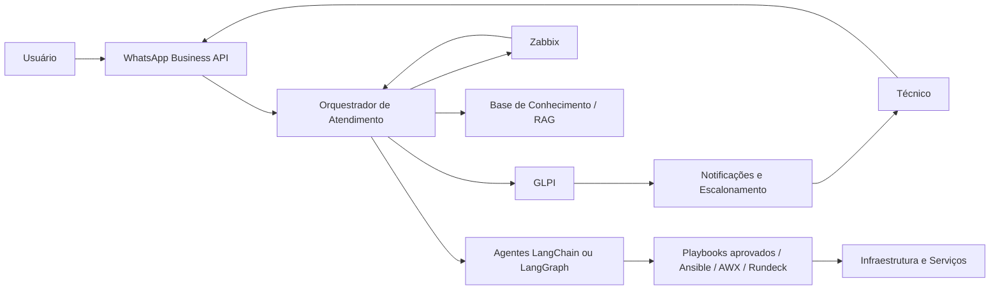

# ITSM GLPI Automação de atendimento Infraestrutura e Monitoramento com Inteligência Artificial 

Plataforma base para automação de infraestrutura, servicedesk e atendimento inteligente com integração entre GLPI, Zabbix, WhatsApp e agentes baseados em LangChain.

## Visão do projeto

Este repositório começou como um instalador rápido para Debian 12 com Apache, PHP, MariaDB, Docker, Kubernetes, Zabbix e GLPI. A evolução proposta agora é transformar essa base em uma plataforma de helpdesk e operações de infraestrutura com os seguintes objetivos:

- Provisionar rapidamente o ambiente base de observabilidade e ITSM.
- Integrar WhatsApp como canal de atendimento para usuários e técnicos.
- Permitir abertura, consulta e atualização de chamados via conversa.
- Correlacionar alertas do Zabbix com incidentes no GLPI.
- Usar agentes de IA para triagem, resumo, diagnóstico assistido e execução controlada de automações.
- Implementar hierarquia operacional entre usuário final, técnico, supervisor e administradores.

## Escopo atual

Hoje o projeto contém dois grandes blocos:

- Provisionamento inicial do servidor Debian 12 com stack base de infraestrutura.
- Documentação da arquitetura-alvo para a plataforma de servicedesk automatizada.

O instalador atual foi movido para um arquivo próprio:

```bash
bash install_debian12_full_stack.sh
```

## Aplicações da solução

Este projeto não deve mais ser lido como um único instalador. A solução completa é composta por aplicações separadas, com implantação por camadas:

- `install_debian12_full_stack.sh`: prepara o host base e instala GLPI e Zabbix em host dedicado.
- `backend/`: aplicação separada em FastAPI para orquestrar WhatsApp, GLPI, Zabbix, identidade e regras operacionais.
- WhatsApp Business API: integração externa para entrada e saída de mensagens.
- IA do bot: `ollama` local como padrão, com opção de troca para `openai`, `groq`, `gemini` ou `claude`.
- Camada de automação segura: Ansible, AWX ou Rundeck para execução homologada de playbooks.
- Camada futura de IA e conhecimento: agentes, RAG, fila assíncrona e banco operacional próprio.

O detalhamento de quais aplicações existem, o que já está coberto no repositório e a ordem recomendada de implantação fica em [Aplicações e implantação](docs/aplicacoes-e-implantacao.md).

## Arquitetura proposta



## Fluxos principais

1. Usuário abre chamado pelo WhatsApp.
2. O orquestrador identifica o usuário, valida permissões e coleta contexto mínimo.
3. O chamado é criado no GLPI com categoria, impacto, urgência e dados adicionais.
4. Se houver alerta relacionado no Zabbix, o incidente é enriquecido com host, trigger, severidade e histórico.
5. O técnico recebe notificação com resumo, classificação inicial e sugestão de runbook.
6. O técnico pode consultar agentes para diagnóstico, resumo do histórico, próximos passos e automações permitidas.
7. A execução operacional acontece apenas por ferramentas autorizadas, com trilha de auditoria e política de aprovação.

## Perfis e hierarquia

- Usuário final: abre chamado, consulta status, envia evidências e recebe atualizações.
- Técnico N1: recebe chamados, executa diagnósticos de baixo risco e usa agentes para triagem.
- Técnico N2 ou N3: atua em incidentes complexos, acessa automações avançadas e aprova mudanças técnicas.
- Supervisor: acompanha fila, define prioridades, aprova ações sensíveis e revisa indicadores.
- Administrador: mantém credenciais, integrações, catálogos de serviço, políticas e observabilidade.

## Automações prioritárias

- Abertura de chamado por texto, áudio ou imagem enviada no WhatsApp.
- Consulta de status de chamado sem necessidade de acessar portal web.
- Correlação automática entre incidente do GLPI e evento do Zabbix.
- Enriquecimento do ticket com hostname, IP, serviço afetado, últimas alterações e runbook sugerido.
- Notificação proativa para técnicos e supervisores em incidentes críticos.
- Execução assistida de playbooks aprovados, como teste de conectividade, coleta de logs e reinício controlado de serviços.
- Geração automática de resumo técnico e fechamento padronizado do atendimento.

## Guardrails obrigatórios

- Não permitir que o modelo execute shell livre ou comandos arbitrários.
- Toda automação deve sair de uma allowlist de ferramentas e playbooks.
- Segredos devem ficar em cofre dedicado, nunca em prompt ou texto aberto.
- Toda ação técnica precisa gerar auditoria, usuário responsável, horário e resultado.
- Ações destrutivas ou com impacto operacional exigem aprovação explícita.
- O canal de WhatsApp deve usar API oficial ou fornecedor homologado para produção.

## Estrutura atual do repositório

```text
.
├── README.md
├── backend/
│   ├── README.md
│   ├── app/
│   ├── tests/
│   └── pyproject.toml
├── docs/
│   ├── arquitetura-helpdesk.md
│   ├── automacoes-sugeridas.md
│   └── roadmap.md
├── infra/
│   ├── README.md
│   ├── automation-runner/
│   ├── backend/
│   ├── glpi/
│   ├── helpdesk-lab/
│   ├── observability/
│   └── zabbix/
├── install_debian12_full_stack.sh
```

## Documentação complementar

- [Arquitetura detalhada](docs/arquitetura-helpdesk.md)
- [Aplicações e estratégia de implantação](docs/aplicacoes-e-implantacao.md)
- [Guia passo a passo para implantação em empresa](docs/implantacao-empresa.md)
- [Guia para empresa com GLPI e Zabbix ja existentes](docs/implantacao-ambiente-existente.md)
- [Checklist de fechamento do MVP](docs/fechamento-mvp.md)
- [Checklist executivo de go-live](docs/checklist-go-live.md)
- [Fase 5: Operacao avancada](docs/fase-5-operacao-avancada.md)
- [Catálogo inicial de automações e agentes](docs/automacoes-sugeridas.md)
- [Portas e conectividade](docs/portas-e-conectividade.md)
- [Roadmap de implantação](docs/roadmap.md)
- [Guia do backend MVP](backend/README.md)
- [Laboratório isolado GLPI e Zabbix](infra/helpdesk-lab/README.md)

## Direção técnica recomendada

- GLPI como sistema oficial de chamados, filas, SLA e base de ativos.
- Zabbix como origem de eventos operacionais e monitoração.
- Um backend de orquestração como núcleo de integração entre canais, agentes e ferramentas.
- LangGraph como alternativa preferível se o fluxo exigir estado, aprovações e handoff entre agentes.
- Ansible, AWX ou Rundeck como camada de execução segura para automações.
- Banco operacional separado para o backend da plataforma, evitando acoplamento indevido com a base do GLPI.

## Atenção às portas

- Este projeto não deve presumir que `80`, `443`, `3306`, `10050` e `10051` estejam livres no host.
- O backend local foi movido para a faixa `18001-18010`, com seleção automática de porta livre.
- O instalador de stack completa agora deve ser tratado como exclusivo para host dedicado ou revisado antes de uso em host com Docker.

## Hierarquia operacional no MVP

- O backend já consegue resolver o papel do remetente a partir do número de telefone usando o diretório local de identidades.
- A base inicial fica em [backend/data/identities.json](/home/ricardo/Script_Linux_Debian/backend/data/identities.json).
- Isso permite distinguir usuário final, técnico, supervisor e admin nos fluxos do WhatsApp antes de integrar uma base corporativa real.
- Técnicos, supervisores e admins já podem usar comandos operacionais via WhatsApp com prefixo `/`, sem misturar esse fluxo com abertura de chamado.
- O mesmo diretório local também pode mapear `glpi_user_id` para vincular o solicitante real durante a criação do ticket no GLPI.

## Próximos passos sugeridos

1. Estruturar o backend de integração entre WhatsApp, GLPI e Zabbix.
2. Definir o modelo de autenticação e vínculo entre número de telefone, usuário e perfil técnico.
3. Criar o primeiro fluxo MVP: abrir chamado pelo WhatsApp e notificar o técnico.
4. Adicionar correlação com alertas do Zabbix.
5. Introduzir agentes apenas para triagem e resumo antes de liberar execução operacional.

## Laboratório pronto para integração

Com o stack do laboratorio ativo em `infra/helpdesk-lab`, o fluxo de integracao e seed fica:

```bash
cd /home/ricardo/Script_Linux_Debian/infra/helpdesk-lab
./scripts/seed-test-data.sh
```

Depois:

```bash
cd /home/ricardo/Script_Linux_Debian/backend
./run_dev.sh
```

Isso deixa o backend apontando para:

- GLPI: `http://127.0.0.1:8088/apirest.php`
- Zabbix: `http://127.0.0.1:8089/api_jsonrpc.php`
- identidades de laboratorio: `backend/data/identities.lab.json`
