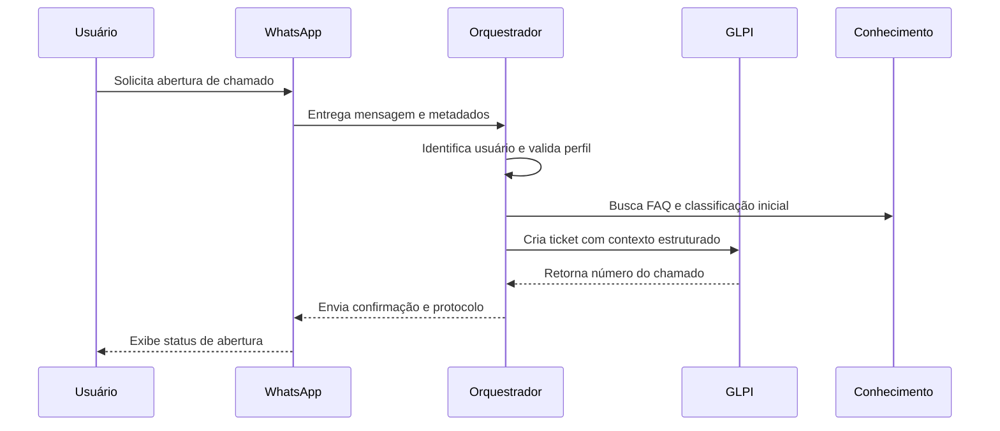

# Arquitetura de Helpdesk e Infraestrutura

## Objetivo

Esta arquitetura propõe uma plataforma única para atendimento, operação de infraestrutura e automação assistida por IA. O foco é unir ITSM, observabilidade e execução controlada em um fluxo auditável.

## Princípios de projeto

- GLPI continua sendo a fonte oficial de chamados, filas, SLA e inventário.
- Zabbix continua sendo a fonte oficial de eventos, métricas e alertas.
- O WhatsApp funciona como canal conversacional, não como repositório de estado.
- O backend de orquestração concentra regras, permissões, auditoria e integrações.
- Os agentes de IA sugerem, classificam, resumem e preparam ações, mas não executam livremente.
- Execução operacional deve ocorrer apenas por runbooks e ferramentas aprovadas.

## Componentes lógicos

| Camada | Componente recomendado | Responsabilidade |
| --- | --- | --- |
| Provisionamento | Bash + Ansible | Instalação da stack base e configuração repetível |
| Canal conversacional | WhatsApp Business API | Entrada e saída de mensagens para usuários e técnicos |
| Núcleo da plataforma | Backend de orquestração | Regras de negócio, RBAC, auditoria, webhooks e integração |
| ITSM | GLPI | Chamados, categorias, SLA, filas, usuários e ativos |
| Observabilidade | Zabbix | Alertas, triggers, hosts, disponibilidade e eventos |
| IA e fluxos | LangChain ou LangGraph | Classificação, resumo, RAG, orquestração multiagente |
| Execução segura | Ansible, AWX ou Rundeck | Execução controlada de ações técnicas |
| Persistência operacional | Banco dedicado | Sessões, auditoria, preferências, cache e fila lógica |
| Conhecimento | Base documental + índice vetorial | FAQ, runbooks, artigos técnicos e histórico operacional |

## Stack recomendada para a próxima fase

| Área | Recomendação inicial |
| --- | --- |
| API principal | Python com FastAPI |
| Agentes e workflows | LangGraph |
| Processamento assíncrono | Celery ou RQ |
| Fila ou broker | Redis ou RabbitMQ |
| Banco operacional | PostgreSQL |
| Busca vetorial | pgvector ou solução dedicada |
| Execução de runbooks | Ansible com AWX |
| Observabilidade da plataforma | Loki, Prometheus, Grafana ou stack equivalente |

## Serviços internos sugeridos

- Serviço de autenticação e perfil: associa telefone, usuário, matrícula, grupo e papel.
- Serviço de tickets: cria, consulta, atualiza e fecha chamados no GLPI.
- Serviço de eventos: recebe webhooks ou consulta eventos do Zabbix.
- Serviço de correlação: detecta vínculo entre alertas, ativos e incidentes existentes.
- Serviço de conhecimento: indexa procedimentos, FAQ, inventário e histórico.
- Serviço de agentes: expõe tools, políticas e contexto para os agentes.
- Serviço de execução: envia jobs para playbooks aprovados e registra retorno.
- Serviço de auditoria: rastreia prompts, decisões, aprovações e ações executadas.

## Fluxo de abertura de chamado via WhatsApp

## Fluxo de incidente monitorado

1. O Zabbix gera trigger crítica para host ou serviço.
2. O backend consulta CMDB e tickets abertos no GLPI.
3. Se existir chamado correlacionado, o incidente é enriquecido.
4. Se não existir, um ticket é criado automaticamente seguindo regra de severidade.
5. O técnico recebe notificação resumida no WhatsApp e no painel operacional.
6. O agente sugere diagnóstico inicial e próximos passos com base em runbooks e histórico.

## Modelo de permissões

- Usuário final não executa automações técnicas.
- Técnico N1 executa apenas tarefas de baixo risco e leitura operacional.
- Técnico N2 ou N3 pode solicitar playbooks avançados com trilha de auditoria.
- Supervisor aprova ações de impacto médio ou alto.
- Administrador gerencia catálogos, tokens, segredos e políticas.

## Integrações mínimas do MVP

- Integração GLPI para criar e consultar chamados.
- Integração Zabbix para consultar alertas e hosts.
- Integração WhatsApp para entrada e saída de mensagens.
- Base de conhecimento simples para respostas e classificação inicial.

## Requisitos não funcionais

- Auditoria completa de todas as decisões automatizadas.
- Retentativa idempotente em integrações externas.
- Segregação entre ambiente de produção e laboratório.
- Observabilidade do próprio orquestrador.
- Controle de custos e limites de uso do modelo.
- Conformidade com política interna e LGPD para tratamento de dados.

## Decisões importantes

- Não acoplar a lógica do bot diretamente ao GLPI.
- Não usar o LLM como executor direto de shell ou SSH.
- Não depender de uma única integração informal de WhatsApp para produção.
- Não misturar banco operacional do backend com banco do GLPI.

## Entregáveis técnicos esperados

- API de orquestração com autenticação e RBAC.
- Conectores estáveis para GLPI e Zabbix.
- Catálogo versionado de playbooks.
- Pipeline de indexação da base de conhecimento.
- Política de aprovação para automações de risco.
