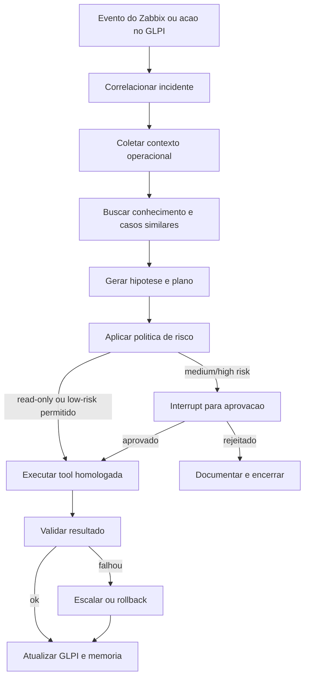

# Estudo de Autonomia com LangChain e LangGraph para Ambiente Monitorado

## Objetivo

Este estudo define o que realmente precisa existir para uma camada baseada em `LangChain` e `LangGraph` operar com autonomia util no contexto deste projeto: receber sinais do ambiente monitorado, entender o incidente, escolher o proximo passo seguro, executar apenas o que for permitido, validar o resultado e retroalimentar o GLPI.

O ponto central e este:

- `LangGraph` deve ser o runtime de orquestracao do agente.
- `LangChain` deve entrar como biblioteca de ferramentas, modelos, retrieval e saida estruturada.
- O backend atual continua sendo a fronteira de negocio, RBAC, auditoria e integracao.
- O GLPI e o Zabbix continuam como fontes oficiais de estado operacional.

Autonomia, aqui, nao significa "deixar o modelo agir livremente". Significa operar com contexto, politicas, memoria duravel, checkpoints, trilha de auditoria, rollback e aprovacao quando o risco exigir.

## Resumo executivo

Leitura curta:

- o repositorio ja tem uma base boa para automacao assistida;
- ainda nao tem os blocos necessarios para autonomia operacional real com `LangGraph`;
- a maior lacuna nao e o modelo, e sim a camada de ferramentas, politicas, memoria, conhecimento e validacao;
- o caminho correto nao e plugar um agente generico direto no GLPI ou no shell;
- o caminho correto e construir um runtime de incidentes com grafo explicito, tools tipadas, persistencia duravel, `human-in-the-loop` por politica e avaliacao continua.

Conclusao pratica:

- hoje o projeto esta pronto para `assistencia` e para `semi-autonomia` muito controlada;
- ainda nao esta pronto para `autonomia restrita` em producao;
- ainda esta longe de `autonomia ampla` para remediacao livre.

### Atualizacao de implementacao em abril de 2026

Desde a versao inicial deste estudo, a fundacao do runtime ja deixou de ser apenas proposta e passou a existir no backend.

Ja foi implementado:

- dependencias `langchain`, `langgraph`, `langgraph-checkpoint-postgres` e `psycopg` no `backend/pyproject.toml`;
- pacote `backend/app/agent_runtime/` com `state.py`, `graph.py`, `policies.py`, `tools/read_only.py`, `knowledge.py` e `memory_store.py`;
- endpoint interno `POST /api/v1/helpdesk/agent/investigate`, protegido pelo escopo de leitura administrativa;
- runtime `shadow/read-only` com `StateGraph` explicito, `thread_id` estavel, `checkpoint` em memoria e suporte a PostgreSQL quando configurado;
- tools read-only para ticket, auditoria, correlacao com Zabbix, catalogo homologado, historico semelhante, runbooks locais e memoria operacional do agente;
- memoria operacional propria do agente, separada do GLPI, com namespace por classe de incidente e servico;
- testes cobrindo investigacao, `checkpoint history`, recuperacao de conhecimento e reuso de memoria entre incidentes parecidos.

Em outras palavras:

- a Fase A ja esta funcional;
- a Fase B comecou de forma heuristica e auditavel;
- o principal gap agora nao e mais "ter ou nao ter runtime", e sim amadurecer retrieval, aprovacao por politica e execucao homologada.

## O que "autonomo" significa neste projeto

### Nivel 0: assistencia

O agente resume, classifica, sugere fila, sugere causa provavel e recomenda proximos passos.

Esse nivel ja esta parcialmente presente no repositorio.

### Nivel 1: semi-autonomia

O agente:

- coleta evidencias sozinho;
- correlaciona GLPI, Zabbix e historico;
- propoe uma acao homologada;
- pede aprovacao humana quando a politica exigir;
- executa e documenta o resultado.

Esse deve ser o primeiro alvo realista.

### Nivel 2: autonomia restrita

O agente executa sozinho apenas acoes de baixo risco e totalmente homologadas, por exemplo:

- coleta de diagnostico;
- leitura de status;
- snapshot operacional;
- restart de servico nao critico com pre-check e post-check;
- anexacao de evidencias ao ticket;
- atualizacao estruturada do GLPI.

Esse nivel so e aceitavel quando houver politica madura, catalogo de runbooks, avaliacao continua e validacao pos-acao.

### Nivel 3: autonomia ampla

O agente decide e executa mudancas relevantes sem aprovacao humana frequente.

Para este projeto, esse nivel nao deve ser objetivo inicial. Em ambiente monitorado de infraestrutura, isso aumenta muito o risco de dano colateral, loops de remediacao e mudancas fora de janela.

## Leitura do estado atual do repositorio

### O que ja existe

O projeto ja tem blocos importantes que ajudam muito:

- integracao com GLPI em `backend/app/services/glpi.py`;
- integracao inicial com Zabbix em `backend/app/services/zabbix.py`;
- cliente LLM provider-agnostic em `backend/app/services/llm.py`;
- triagem com heuristica local e enriquecimento opcional por LLM em `backend/app/services/triage.py`;
- advice de resolucao por ticket em `backend/app/orchestration/helpdesk.py`;
- store operacional com auditoria, fila logica, expiracao, retry e `dead-letter` em `backend/app/services/operational_store.py`;
- worker seguro de automacao em `backend/app/workers/automation_worker.py`;
- catalogo inicial de automacoes homologadas em `backend/app/services/automation.py`;
- snapshot analitico de tickets e historico operacional em `backend/app/services/ticket_analytics_store.py` e `backend/app/services/glpi_analytics.py`;
- runtime inicial do agente em `backend/app/agent_runtime/graph.py`, com fluxo explicito de investigacao;
- tools read-only do runtime em `backend/app/agent_runtime/tools/read_only.py`;
- recuperacao de conhecimento local em `backend/app/agent_runtime/knowledge.py`;
- memoria operacional duravel do agente em `backend/app/agent_runtime/memory_store.py`;
- endpoint interno para investigacao assistida em `backend/app/api/routes/helpdesk.py`;
- base documental ja alinhada para manter `LangChain` ou `LangGraph` acima da camada transacional do backend.

### O que isso significa na pratica

O projeto ja sabe:

- abrir, consultar e enriquecer tickets;
- recuperar parte do contexto operacional;
- manter trilha de auditoria;
- aprovar ou rejeitar automacoes por risco;
- executar um conjunto muito pequeno de runbooks homologados;
- sugerir resolucao segura com base em historico e heuristica;
- investigar incidente com `LangGraph` sem executar mudanca;
- recuperar incidentes parecidos, runbooks locais e memoria operacional do proprio agente;
- manter `checkpoint` do fluxo de investigacao com fallback em memoria e suporte a PostgreSQL.

### O que ainda nao existe

Ainda faltam os blocos que tornam um agente realmente operacional:

- camada real de `RAG` com indice vetorial;
- tool registry mais amplo para observabilidade, diagnostico, remediacao e governance;
- politicas de autonomia por risco, confianca, janela e criticidade;
- avaliacao offline e online do comportamento do agente;
- observabilidade profunda do proprio agente;
- catalogo de remediacao grande o bastante para incidentes reais;
- rollback e verificacao pos-acao padronizados;
- controle de concorrencia por host, servico, ticket ou incidente;
- correlacao mais rica com topologia, dependencias e manutencao programada.

## Decisao recomendada de arquitetura

### Papel de cada tecnologia

`LangGraph`:

- orquestrar o fluxo do incidente;
- manter o estado da execucao;
- pausar para aprovacao;
- retomar execucao apos aprovacao ou erro;
- separar subgrafos de diagnostico, aprovacao, execucao e validacao.

`LangChain`:

- integrar modelos;
- definir tools com schema;
- estruturar retrieval;
- padronizar saidas estruturadas;
- reaproveitar middleware e adaptadores.

Backend atual:

- continuar como API principal;
- aplicar RBAC, auditoria, limite de privilegio e politicas corporativas;
- centralizar conectores com GLPI, Zabbix, WhatsApp e runner homologado;
- expor ferramentas seguras para o runtime de agente.

### Decisao de desenho

Nao recomendo usar um agente generico de chat como motor principal de remediacao.

Recomendo:

- usar `StateGraph` explicito para o ciclo de incidente;
- usar tools pequenas, tipadas e auditaveis;
- deixar o modelo decidir apenas dentro de corredores estreitos;
- manter as mudancas reais sempre encapsuladas em runbooks homologados.

Em resumo:

- o modelo decide "qual acao homologada faz sentido";
- a plataforma decide "se pode executar";
- o runner executa "como";
- o Zabbix e o GLPI dizem "se funcionou".

## Capacidades obrigatorias para autonomia util

## 1. Ferramentas operacionais tipadas

O agente precisa de tools reais. Hoje o projeto tem poucas.

O conjunto minimo deveria ser dividido assim:

### Leitura e observabilidade

- buscar problemas ativos no Zabbix por host, trigger, severidade, servico ou janela;
- obter status atual de host, item, trigger e dependencia;
- consultar eventos recentes relacionados;
- consultar manutencao programada e suppressions;
- obter saude de componentes internos do proprio backend;
- recuperar resumo operacional do ticket e do ativo.

### Contexto de ITSM

- criar ticket;
- atualizar ticket;
- adicionar followup estruturado;
- atribuir fila ou grupo;
- anexar evidencias;
- registrar `solution` estruturada;
- correlacionar ticket com evento, host, servico e incidente pai.

### Diagnostico seguro

- rodar playbooks read-only homologados;
- coletar logs, status de servico, DNS, rede, portas, espaco, CPU e memoria;
- consultar inventario e CMDB;
- recuperar incidentes parecidos e solucoes anteriores;
- verificar se houve mudanca recente no alvo.

### Remediacao controlada

- restart de servico homologado;
- limpeza de cache homologada;
- reexecucao de job conhecido;
- troca controlada de configuracao de baixo risco;
- rollback homologado;
- validacao pos-remediacao.

### Governance

- checar risco da acao;
- checar se o alvo esta em janela de mudanca;
- checar se a acao exige aprovacao;
- solicitar aprovacao humana;
- registrar a decisao;
- bloquear acoes proibidas.

### Contrato de cada tool

Cada tool operacional precisa ter:

- nome estavel;
- schema de entrada tipado;
- descricao objetiva para o modelo;
- classificacao `read-only` ou `write`;
- pre-condicoes;
- efeito colateral esperado;
- timeout;
- limites de concorrencia;
- criterio de sucesso;
- estrategia de rollback;
- formato estruturado de saida;
- evento de auditoria associado.

Sem isso, o agente vira um chamador de funcoes opaco e dificil de governar.

## 2. Runtime de incidente com grafo explicito

O fluxo de incidente precisa deixar de ser um encadeamento informal de chamadas e virar um grafo com passos claros.

### Grafo minimo recomendado

### Subgrafos recomendados

- `incident_intake_graph`
- `context_enrichment_graph`
- `diagnosis_graph`
- `remediation_graph`
- `approval_graph`
- `validation_graph`
- `postmortem_graph`

Essa separacao ajuda a controlar risco, testar por partes e reusar blocos.

## 3. Persistencia duravel do estado do agente

Sem persistencia, nao existe autonomia segura. Existe apenas execucao fragil.

O runtime precisa salvar:

- estado corrente do incidente;
- plano atual;
- ferramentas ja executadas;
- evidencias coletadas;
- aprovacoes pendentes;
- checkpoints de retomada;
- resultado da validacao;
- contexto resumido para proximas iteracoes.

### Recomendacao tecnica

- usar `checkpointer` duravel em PostgreSQL;
- usar `thread_id` estavel por ticket, incidente pai ou correlacao operacional;
- manter `interrupts` para aprovacao, timeout e retomada humana;
- garantir que passos com efeito colateral sejam idempotentes ou encapsulados em tarefas seguras.

O projeto ja tem PostgreSQL e estado operacional. Isso ajuda muito, mas ainda falta a camada nativa de estado do `LangGraph`.

## 4. Memoria de curto e longo prazo

Para incidentes operacionais, memoria nao e "lembrar conversa". E lembrar contexto util e regras aprendidas.

### Memoria de curto prazo

Deve guardar o estado vivo do incidente atual:

- ultimo diagnostico;
- host e servico impactados;
- hipoteses ja testadas;
- acoes ja executadas;
- evidencias relevantes;
- ultimo status do ticket;
- restricoes vigentes.

### Memoria de longo prazo

Deve guardar conhecimento reutilizavel entre incidentes:

- solucoes recorrentes por categoria, servico, host ou classe de ativo;
- runbooks eficazes por tipo de incidente;
- parametros preferenciais por ambiente;
- sinais de falha conhecidos;
- regras locais da operacao;
- historico de remediacoes bem-sucedidas e malsucedidas.

### Recomendacao tecnica

- usar store em PostgreSQL para memoria duravel;
- indexar memoria e conhecimento para busca por similaridade;
- separar namespace por `empresa`, `ambiente`, `servico`, `tipo_de_incidente` e `criticidade`;
- nunca misturar memoria do agente com banco do GLPI.

## 5. Camada real de conhecimento e RAG

Hoje este e um dos maiores gaps.

Sem `RAG`, o agente fica preso a:

- prompt;
- historico curto do ticket;
- heuristicas locais.

Isso nao basta para resolver incidentes reais de infraestrutura.

### Fontes que precisam ser indexadas

- FAQ operacional;
- runbooks homologados;
- artigos tecnicos internos;
- solucoes e followups do GLPI;
- historico de incidentes resolvidos;
- taxonomia de servicos e ativos;
- diagramas logicos e dependencias;
- janelas de manutencao;
- politicas de risco;
- post-mortems;
- resultados de automacoes anteriores.

### Requisitos de qualidade do RAG

- chunking com metadados operacionais ricos;
- filtro por ambiente, servico, criticidade e data;
- versionamento de documentos;
- sinalizacao de fonte e confianca;
- bloqueio de documentos obsoletos;
- avaliacao de retrieval antes de liberar acao automatica.

## 6. Politica de autonomia e guardrails

Este e o bloco mais importante da autonomia.

O agente so pode ser autonomo quando a plataforma souber dizer claramente:

- o que ele pode fazer;
- em que contexto pode fazer;
- com qual risco pode fazer;
- quando precisa de humano;
- quando precisa escalar;
- quando precisa parar.

### Politica minima recomendada

Cada acao precisa ser classificada por:

- risco;
- reversibilidade;
- impacto potencial;
- criticidade do alvo;
- janela permitida;
- necessidade de ticket;
- necessidade de aprovacao;
- necessidade de rollback disponivel;
- necessidade de validacao pos-acao.

### Regra pratica de decisao

`read-only`:

- pode autoexecutar;
- sempre auditar;
- sempre anexar evidencia ao ticket.

`low-risk` com rollback e validacao:

- pode autoexecutar em horario permitido;
- deve ter score minimo de confianca;
- deve ter trava por alvo para evitar corrida.

`moderate-risk`:

- sempre exigir aprovacao humana;
- exigir justificativa estruturada;
- exigir plano e rollback.

`high-risk` ou destrutiva:

- proibida para o agente no escopo inicial.

### Guardrails nao negociaveis

- nunca expor shell arbitrario ao modelo;
- nunca liberar SSH generico;
- nunca executar SQL livre;
- nunca permitir chamada HTTP arbitraria para qualquer destino;
- nunca atualizar GLPI ou ambiente sem `ticket_id` ou `incident_id`;
- nunca executar mais de uma remediacao concorrente no mesmo alvo sem lock;
- nunca fechar incidente sem validacao pos-acao.

## 7. Catalogo de remediacao homologada

Hoje o catalogo inicial e bom como prova de conceito, mas insuficiente para autonomia.

O agente precisa de um catalogo mais amplo, por dominio:

- rede;
- DNS;
- Linux base;
- containers;
- banco de dados;
- middleware;
- aplicacoes internas;
- observabilidade;
- backup;
- integracoes.

### Cada runbook homologado precisa incluir

- objetivo;
- alvo permitido;
- parametros aceitos;
- pre-check;
- acao principal;
- post-check;
- rollback;
- risco;
- dono tecnico;
- janela recomendada;
- exemplos de uso;
- saida estruturada.

Sem esse catalogo, o agente ate pode diagnosticar, mas nao resolve.

## 8. Correlacao operacional mais forte

Hoje a correlacao com Zabbix ainda e inicial.

Para resolver problemas do ambiente monitorado, o agente precisa cruzar:

- host;
- servico;
- trigger;
- severidade;
- localidade;
- grupo operacional;
- item de inventario;
- dependencia tecnica;
- manutencao programada;
- incidentes abertos;
- mudancas recentes;
- historico semelhante.

### Resultado esperado

Antes de agir, o agente deve saber responder:

- isso e incidente isolado ou em massa;
- qual servico de negocio esta impactado;
- existe incidente pai aberto;
- existe manutencao em andamento;
- ja houve falha igual recentemente;
- existe remediacao padrao homologada;
- a falha provavelmente e infra, aplicacao, dependencia ou acesso.

## 9. Validacao pos-acao e rollback

Agente autonomo sem validacao pos-acao nao e autonomo; e apenas executor cego.

Toda acao com efeito colateral precisa terminar com:

- rechecagem do Zabbix;
- rechecagem local do alvo;
- comparacao de antes e depois;
- atualizacao do ticket;
- criterio claro de sucesso ou falha;
- rollback quando o sucesso nao for comprovado.

### Exemplo de ciclo correto

1. trigger critica detectada;
2. agente coleta contexto e evidencia;
3. encontra runbook homologado;
4. politica permite `restart` de baixo risco;
5. executa restart;
6. roda post-check;
7. verifica normalizacao no Zabbix;
8. atualiza o GLPI com evidencia e resultado;
9. se nao normalizou, reverte ou escala.

## 10. Observabilidade do proprio agente

O agente precisa ser observavel como qualquer sistema de producao.

### Medidas minimas

- traces por execucao;
- historico de tool calls;
- latencia por etapa;
- custo por incidente;
- taxa de aprovacao, rejeicao e rollback;
- taxa de sucesso por runbook;
- repeticao de incidentes por classe;
- falha de retrieval;
- falha de politica;
- falha de validacao pos-acao.

### O que registrar

- prompt efetivo resumido;
- ferramentas expostas ao modelo;
- ferramenta escolhida;
- argumentos finais aprovados;
- resultado estruturado;
- motivo de bloqueio ou escalonamento;
- evidencia usada na decisao.

## 11. Avaliacao continua do agente

Autonomia sem avaliacao vira regressao silenciosa.

O agente precisa de avaliacao em dois modos:

### Offline

Com dataset curado de incidentes reais e sinteticos:

- problema de DNS;
- host indisponivel;
- alarme falso;
- servico degradado;
- incidente em massa;
- manutencao ativa;
- remediation success;
- remediation fail com rollback.

### Online

Com avaliacao em producao, por amostragem e alertas:

- qualidade do plano;
- qualidade do retrieval;
- aderencia a politica;
- sucesso real da remediacao;
- taxa de acao bloqueada corretamente;
- taxa de falso positivo de autonomia.

### Metricas recomendadas

- `first_tool_accuracy`
- `incident_correlation_accuracy`
- `retrieval_relevance`
- `policy_adherence`
- `remediation_success_rate`
- `rollback_rate`
- `human_override_rate`
- `mttr_delta`

## 12. Seguranca e compliance

Autonomia operacional aumenta a superficie de risco. Alguns controles precisam existir antes do agente crescer.

### Controles minimos

- segredos em cofre, nunca em prompt;
- tokens com escopo minimo;
- identidade separada para leitura, aprovacao e execucao;
- trilha de auditoria imutavel;
- sanitizacao de payloads;
- isolamento entre laboratorio e producao;
- allowlist de destinos, hosts e playbooks;
- criptografia de dados sensiveis;
- retencao e expiracao de historico operacional;
- LGPD e minimizacao de dados pessoais.

## 13. Desenho tecnico recomendado para este repositorio

### Componentes novos

- `backend/app/agent_runtime/graph.py`
- `backend/app/agent_runtime/state.py`
- `backend/app/agent_runtime/tools/`
- `backend/app/agent_runtime/policies.py`
- `backend/app/agent_runtime/knowledge/`
- `backend/app/agent_runtime/evaluation/`

### Papeis dos componentes

`graph.py`:

- define o `StateGraph` principal;
- compila subgrafos;
- conecta `checkpointer` e store.

`state.py`:

- define schema de estado do incidente;
- separa campos de contexto, plano, evidencia, aprovacao e execucao.

`tools/`:

- encapsula GLPI, Zabbix, analytics, runner e knowledge;
- impede que o modelo fale direto com clientes brutos.

`policies.py`:

- converte tipo de incidente e tipo de acao em regra executavel;
- decide se autoexecuta, interrompe ou bloqueia.

`knowledge/`:

- indexacao;
- retrieval;
- filtros por ambiente;
- memoria de longo prazo.

`evaluation/`:

- datasets;
- scorecards;
- replay de incidentes.

### Reuso do que ja existe

O runtime novo deve reaproveitar:

- `GLPIClient`;
- `ZabbixClient`;
- `AutomationService`;
- `OperationalStore`;
- `TicketAnalyticsStore`;
- regras de seguranca e tokens ja existentes;
- fila e worker onde fizer sentido.

Ou seja: nao e refazer a plataforma. E adicionar uma camada de runtime autonomo em cima dela.

## 14. Dependencias tecnicas que faltam

O baseline da stack de agentes ja entrou no `backend/pyproject.toml`.

Ja presentes:

- `langchain`
- `langgraph`
- `langgraph-checkpoint-postgres`
- `psycopg` com suporte a `binary` e `pool`

O conjunto que ainda falta para as proximas fases inclui algo nesta linha:

- pacote do provider escolhido para uso via LangChain de forma nativa;
- suporte a embeddings;
- suporte ao indice vetorial, preferencialmente `pgvector`;
- `langsmith` para tracing e avaliacao estruturada;
- biblioteca de reranking ou filtros de retrieval quando o volume documental crescer.

Observacao importante:

- o `LLMClient` atual pode continuar existindo para fluxos simples e para status do provider;
- para o runtime de agente, vale mais usar integracoes nativas da stack LangChain, preservando as mesmas configuracoes de ambiente e governance.

## 15. Gap analysis: atual versus necessario

| Capacidade | Estado atual | Leitura pratica |
| --- | --- | --- |
| Integracao GLPI | boa | pronta para virar tool segura |
| Integracao Zabbix | parcial | leitura basica e correlacao ja existem, mas ainda faltam manutencao, dependencia e topologia |
| Worker e fila | boa | ja ajuda a sustentar remediacao controlada |
| Politica de aprovacao | parcial | existe por automacao, falta por tipo de incidente e confianca |
| LLM basico | parcial | suficiente para assistencia, nao para runtime autonomo |
| Runtime em grafo | inicial | investigacao `shadow/read-only` ja roda com `LangGraph` |
| Checkpoint duravel do agente | parcial | suporte a PostgreSQL existe, mas ainda precisa validacao ampla em ambiente real |
| Memoria de longo prazo | inicial | store proprio do agente ja existe, mas ainda sem politica madura de consolidacao |
| RAG | inicial | retrieval local e heuristico ja existe, mas sem embeddings nem indice vetorial |
| Catalogo de remediacao | inicial | muito pequeno para incidentes reais |
| Rollback padronizado | ausente | hoje ainda e manual ou implicito |
| Avaliacao do agente | ausente | precisa nascer junto com o runtime |
| Observabilidade do agente | inicial | auditoria existe, mas ainda faltam tracing, metricas e scorecards |
| Correlacao de incidentes em massa | parcial | heuristica existe, mas ainda e curta |

## 16. Roadmap recomendado

### Fase A: fundacao do runtime

Entregas:

- adicionar dependencias `LangChain` e `LangGraph`;
- criar schema de estado do incidente;
- criar `checkpointer` em PostgreSQL;
- expor as primeiras tools read-only;
- integrar tracing do agente.

Criterio de saida:

- agente consegue investigar incidente sem executar mudanca.

Status atual:

- fase funcionalmente entregue;
- ainda falta tracing estruturado e validacao mais ampla do `checkpoint` em PostgreSQL fora do laboratorio.

### Fase B: conhecimento e retrieval

Entregas:

- pipeline de indexacao;
- `RAG` para runbooks, solucoes e historico;
- memoria de longo prazo;
- score de relevancia e filtros por ambiente.

Criterio de saida:

- agente recupera conhecimento confiavel e explica de onde tirou a recomendacao.

Status atual:

- fase iniciada;
- ja existe retrieval heuristico de documentos locais, incidentes parecidos e memoria operacional propria;
- ainda faltam embeddings, indice vetorial, reranking e filtros por ambiente/empresa.

### Fase C: semi-autonomia operacional

Entregas:

- subgrafo de aprovacao;
- tools de execucao read-only e low-risk;
- validacao pos-acao;
- atualizacao automatica do GLPI;
- lock por alvo e controle de concorrencia.

Criterio de saida:

- agente executa coleta e remediacao simples com governanca.

Proximo melhor passo realista:

- ligar o runtime atual ao fluxo de aprovacao administrativa ja existente, para o agente propor uma automacao homologada com justificativa e politica antes de qualquer execucao.

### Fase D: autonomia restrita

Entregas:

- politicas por criticidade e janela;
- catalogo expandido de runbooks;
- rollback padronizado;
- avaliacao online;
- dashboards de confianca e sucesso.

Criterio de saida:

- agente autoexecuta apenas acoes de baixo risco com taxa de sucesso medida e auditavel.

## 17. O que eu nao recomendo fazer

- nao colocar o modelo para chamar `GLPIClient` e `ZabbixClient` diretamente sem uma camada de tools;
- nao usar um loop generico de chat como motor de incidente;
- nao liberar shell, SSH ou HTTP arbitrario ao modelo;
- nao misturar memoria do agente com banco do GLPI;
- nao pular `RAG` e esperar que o modelo "lembre" o ambiente;
- nao liberar auto-remediacao antes de ter post-check e rollback;
- nao liberar autonomia em producao sem dataset de avaliacao e shadow mode.

## 18. Conclusao

Para `LangChain` e `LangGraph` ficarem realmente autonomos neste ambiente monitorado, o maior trabalho nao esta em "plugar IA", e sim em construir um sistema operacional de agente:

- com tools homologadas;
- com contexto confiavel;
- com memoria duravel;
- com checkpoints;
- com politicas executaveis;
- com `RAG`;
- com validacao;
- com observabilidade;
- com avaliacao continua.

Minha recomendacao pratica para este projeto e:

1. usar `LangGraph` como runtime principal de incidentes;
2. manter o backend atual como camada de controle e integracao;
3. comecar por semi-autonomia em ferramentas read-only e low-risk;
4. so depois liberar autonomia restrita para remediacao homologada.

Isso preserva o que o repositorio ja construiu bem e evita o erro mais comum dessa fase: trocar governanca por improviso.

## Referencias oficiais consultadas

- LangChain Agents: https://docs.langchain.com/oss/python/langchain/agents
- LangChain Tools: https://docs.langchain.com/oss/python/langchain/tools
- LangGraph Persistence: https://docs.langchain.com/oss/python/langgraph/persistence
- LangGraph Durable Execution: https://docs.langchain.com/oss/python/langgraph/durable-execution
- LangChain Human-in-the-loop: https://docs.langchain.com/oss/python/langchain/human-in-the-loop
- LangChain Long-term memory: https://docs.langchain.com/oss/python/langchain/long-term-memory
- LangSmith Evaluation: https://docs.langchain.com/langsmith/evaluation
